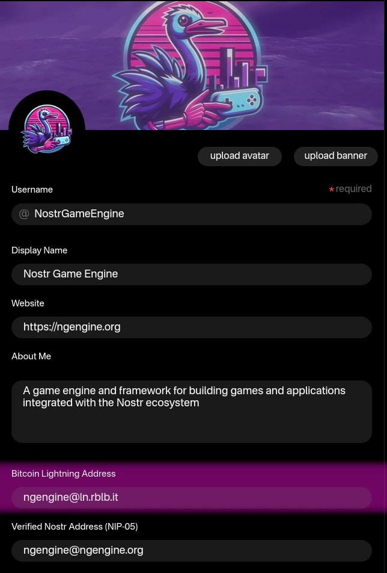

Nostr Game Engine supports **native in-game advertising** through its integration with the [nostrads](https://nostr-ads.ngengine.org/) protocol.


## Preparing the App


Before enabling ads, make sure your application is initialized with a valid `appId` (see [NGEApplication](../getting-started/#ngeapplication)).

The `appId` must correspond to a pubkey that has a valid metadata event containing a **lnurl** or **lightning address** (`lud06` or `lud16`) for receiving ad revenue.

The easiest way to set this up is by using a Nostr client such as [Primal](https://primal.net/). In your profile settings, you’ll find a field where you can set your lightning address:



If you don’t yet have a lightning address for your app, here are some options (from simplest to more advanced):

1. [Blink.sv](https://www.blink.sv/) - custodial mobile wallet that provides a lightning address.
2. [Rizful](https://rizful.com/) - offers both custodial and non-custodial wallets with lightning addresses.
3. [AlbyHub](https://albyhub.com/) - self-hosted non-custodial lightning node with a lightning address.
4. [LNbits](https://lnbits.com/) - self-hosted interface that connects to various Lightning backends and can provide a lightning address via extensions.
 

## Enabling Ads

To enable ads in your app, call the `enableAds` convenience method on `NGEApplication`:

```java
NGEAppRunner appRunner = NGEApplication.createApp(appId, settings, app -> {
    // ... callback once app is ready ....
    app.enableAds();
    // ...
});
```

This will automatically:

* Add an `ImmersiveAdComponent`
* Initialize it with a default set of relays
* Create a random **advertisement key** (an anonymous private key used to identify the current player in the ads network)

If you want to use a custom set of relays and/or a custom advertisement key, you can pass them explicitly:

```java
NostrPrivateKey adsKey = NostrPrivateKey.generate();
app.enableAds(adsKey, List.of("wss://relay.ngengine.org", "wss://relay2.ngengine.org"));
```

!!! note
    How you generate the `adsKey` is up to you.

    - You may generate a new random key for each play session.
    - Or you may persist it across sessions.


    In either case, **never link it directly to the player’s identity**, to preserve privacy.  


## Setting Up the Scene for Ad Spaces

Next, you need to prepare your scene to detect ad spaces and display ads.
This is done by adding an `ImmersiveAdControl` to the `rootNode` (or any other spatial in your scene):

```java
ImmersiveAdControl adControl = new ImmersiveAdControl(assetManager);
map.addControl(adControl);
```

Once added, register the control with the `ImmersiveAdComponent`:

```java
componentManager.getComponent(ImmersiveAdComponent.class).register(adControl);
```

---

### Context-Aware Advertising and Ad Groups

The setup above is enough to start showing ads, but it won’t filter them by context or preferences.
For that, use the extended `ImmersiveAdControl` constructor:

```java
public ImmersiveAdControl(
      @Nonnull AssetManager assetManager,
      @Nullable List<AdTaxonomy.Term> categoryIds,
      @Nullable List<String> languages,
      @Nullable AdPriceSlot priceSlot,
      @Nullable String context // unused for now
) {}
```

!!! tip
    You can obtain `AdTaxonomy.Term` instances either by:

    **Creating a new taxonomy instance**:  
    ```java
    AdTaxonomy taxonomy = new AdTaxonomy();
    ```  

    **Or retrieving it from the component**:  
    ```java
    AdTaxonomy taxonomy = componentManager
        .getComponent(ImmersiveAdComponent.class)
        .getTaxonomy();
    ```  

    Then, fetch terms by ID or path:  

    ```java
    Term term = taxonomy.getById("150");
    Term term = taxonomy.getByPath("Attractions");
    ```  

    For a full list of taxonomy IDs and paths, see the [Nostr Content Taxonomy CSV](https://ngengine.org/docs/nip-drafts/nostr-content-taxonomy/).  


#### Multiple Contexts in the Game World

An `ImmersiveAdControl` only affects the spatial it’s attached to and its subtree.

* If attached to the `rootNode`, it applies to the entire scene.
* You can attach multiple controls to different children of the `rootNode`, each with different filters, allowing different ads in different areas of your game world.

---

#### Advanced Filtering

The `ImmersiveAdControl` also supports a custom filter via:

```java
adControl.setFilter((AdBidEvent event) -> {
    // return true to accept, false to reject
});
```

This lets you implement complex **client-side filtering** logic, tailored to your app’s needs.


## Adding Adspaces to 3D Models

**Adspaces** are 3D surfaces in your game world where ads can be displayed.

The `ImmersiveAdControl` automatically detects adspaces, applies the correct material, and loads ads as textures.
However, you still need to **define the geometry** that will host each adspace.


### Defining Adspaces Programmatically

You can create adspaces directly in code by adding a `Geometry` of any shape (commonly `Quad` or `Box`) and tagging it with the supported resolution:

```java
Geometry adspace = new Geometry("AdQuad", new Quad(2, 4));
adspace.setUserData("nostrads.adspace", "256x512");
```

Here, `"256x512"` is one of the supported resolutions defined by the nostrads protocol.
A full list of valid sizes can be found in the [nostrads documentation](http://localhost:8000/docs/nip-drafts/nip-ADS/#ad-size-and-aspect-ratio) (`s` tag).

!!! note
    You must ensure the geometry’s **aspect ratio** matches the chosen ad size.
    Otherwise, the ad will appear stretched or distorted.


### Defining Adspaces in a 3D Editor (Recommended)

The preferred approach is to define adspaces directly in your 3D modeling tool (e.g. **Blender**).

1. Create a geometry (e.g. a cube or plane) with the correct aspect ratio.
2. Add the custom property:
    - Key: `nostrads.adspace`
    - Value: one of the supported resolutions (e.g. `256x512`).

Resolutions must match the supported sizes defined by the nostrads protocol, in the  [nostrads documentation](http://localhost:8000/docs/nip-drafts/nip-ADS/#ad-size-and-aspect-ratio) (`s` tag).

!!! tip
    In Blender, when exporting to **glTF**, make sure to enable:
    `Include → Custom Properties`
    This ensures your `nostrads.adspace` property is exported correctly.
 