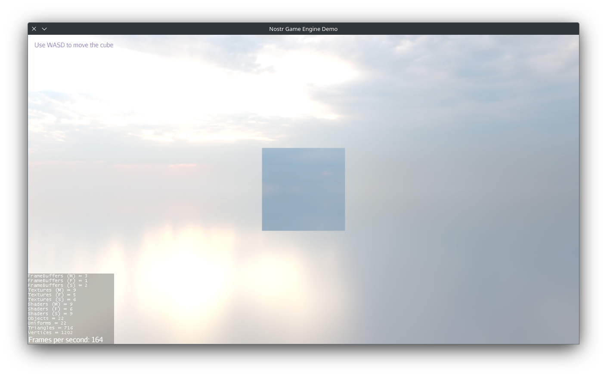

Nostr Game Engine is fully modular: you can pick and choose individual engine components from [Maven Central](https://central.sonatype.com/search?namespace=org.ngengine) and include them in any Gradle project. 

!!! tip
    You are going to need also this repository
    ```groovy
    repositories {
        maven {
            url = "https://maven.rblb.it/NostrGameEngine/libdatachannel-java"
        }
    }
    ```
    that holds a fork of libdatachannel-java used by the network module

However, the quickest way to start development is with the app template, detailed below.

## Bootstrapping with the App Template

Getting started with a new Nostr Game Engine project is easy thanks to the preconfigured Gradle template. 

You can obtain the template in two ways:

- **Clone the repository**:

  ```bash
  git clone https://github.com/NostrGameEngine/nge-app-template.git
  ```

- **Download as ZIP**:

  [Download the Template App](https://github.com/NostrGameEngine/nge-app-template/archive/refs/heads/master.zip){ .md-button }

After downloading, extract the contents to your workspace and open the project in your favorite Java IDE.

!!! tip
    We recommend using [Visual Studio Code](https://code.visualstudio.com/), but any Java-compatible IDE will work. 


### Test the demo app

Before going further, you can try to launch the demo app to ensure everything is set up correctly.

Open a terminal in the project root and run:

```
./gradlew run
```
or on Windows:

```powershell
gradlew.bat run
```



### Configure Project Properties

Edit the `gradle.properties` file in the project root to customize your application details:

```properties
version=0.1
projectName=ngeapp
mainClass=org.example.NGEAppMain
copyright=Copyright (c) 2025
```

you can also change `ngeVersion` if you want to use a different version of the engine.

### Next Steps

The next sections will walk you through the core concepts that make up a Nostr Game Engine application. 
You can start experimenting with the source code you've just downloaded, to see how things work.

Whenever your application is ready, you can head over to the [Building and Distribution](./build.md) section to learn how to package your app for distribution.


## NGEApplication

Everything begins with a `NGEApplication`, which you instantiate via a static method:

```java
Runnable appBuilder = NGEApplication.createApp(app -> {
    // ...
});
```

Notice that `createApp` doesn’t return a `NGEApplication` instance directly. This is intentional: initialization is asynchronous, so you supply a callback that will be invoked once the application is ready.


## App Settings

By default, `createApp(...)` uses standard settings suitable for testing. To customize resolution, or any other setting, you pass an `AppSettings` object to `createApp`:

```java
AppSettings settings = new AppSettings(true);
settings.setRenderer(AppSettings.LWJGL_OPENGL32);
settings.setWidth(1280);
settings.setHeight(720);
settings.setGammaCorrection(true);
settings.setSamples(4);
settings.setStencilBits(8);
settings.setDepthBits(24);
settings.setVSync(true);
settings.setGraphicsDebug(false);
settings.setTitle("Nostr Game Engine Demo");

Runnable appBuilder = NGEApplication.createApp(settings, app -> {
    // ...
});
```


## Initialize and Run!
Once you have the `Runnable` returned from `createApp`, you can call:

```java
appBuilder.run();
```

to begin initializing and running your application.


## Adding and Managing Components

In NGE, you structure your game or application logic via **components**. Each component encapsulates a distinct feature or behavior, making your code modular and reusable. From the callback you supplied to `createApp`, you can retrieve the `ComponentManager` and attach components to it:

```java
Runnable appBuilder = NGEApplication.createApp(settings, app -> {
    ComponentManager mng = app.getComponentManager();
    mng.addComponent(new MyFirstComponent());
    mng.addComponent(new MySecondComponent());
    mng.addComponent(new MyThirdComponent());
    // ...
});
appBuilder.run();
```

To learn how to write your own components, see the [Components section](./components/index.md).

!!! note "For jME3 Developers"
    You can integrate NGE modules into existing jMonkeyEngine 3 applications. Just attach the `ComponentManagerAppState` to your state manager and initialize Lemur with:
    ```java
    GuiGlobals.initialize(this);
    ```

## Enabling and Disabling Components

When you add a component, it starts **disabled** by default. A common pattern is to add all necessary components at startup and enable them selectively. To enable a component (thus starting its logic), you can reference it by its class:

```java
mng.enableComponent(MyFirstComponent.class);
```

You can also pass an argument to the component’s `onEnable(...)` method:

```java
mng.enableComponent(MyFirstComponent.class, myCustomArgument);
```

This is handy if you need to perform runtime configuration. If you’d like to add & enable in one step, use:

```java
mng.addAndEnableComponent(new MyFirstComponent(), myCustomArgument);
```

(The behavior is identical to calling `addComponent(...)` and then `enableComponent(...)` separately.)


## Using Components from Components and Dependencies

Often, one component relies on functionality provided by another. To access another component from a component, you can use this code in the `onEnable(...)` method:

```java
MySecondComponent c1 = mng.getComponent(MySecondComponent.class);        // get by class
MySecondComponent c2 = mng.getComponentById("my-second-component-id");  // get by ID
```

However, if the dependent component isn’t yet enabled, this call will fail. To guarantee proper order, declare a dependency when adding a component to the component manager:

```java
mng.addComponent(new MyFirstComponent(), MySecondComponent.class);
```

Here, `MyFirstComponent` won’t be enabled until **any** instance of `MySecondComponent` is ready and enabled. If you need to target a specific instance, pass its string ID or the actual component reference:

```java
MySecondComponent c = new MySecondComponent();
mng.addComponent(c);                                      // Add second component first
mng.addComponent(new MyFirstComponent(), c);               // MyFirstComponent depends on c
```

!!! warning
    Simply adding components in the “correct” order is not enough. Some initialization steps run asynchronously. Always express explicit dependencies to ensure deterministic startup behavior.

Typically, you’ll designate a “root” or “entry-point” component that has no dependencies. All other components depend on it, and it drives the overall application flow.

!!! tip "Self-Declared Dependencies"
    If you want a component to declare its own dependencies (without needing the caller to specify them), override `onAttached(...)`:
    ```java
    @Override
    public void onAttached(ComponentManager mng) {
        mng.updateComponentDependencies(MyDep1Component.class, MyDep2Component.class);
    }
    ```

    This way, your component remains self-contained and still ensures its dependencies are met at runtime.

!!! tip "Stalling a components"
    Need a component that never gets enabled? Simply depend it on `StallingComponent.class`. It’ll forever wait for that dependency and remain disabled.


## Putting It All Together

Below is a complete example that configures app settings, creates components, declares dependencies, and starts the application:


!!! example
    ```java
    public static void main(String[] args) {     
        AppSettings settings = new AppSettings(true);
        settings.setRenderer(AppSettings.LWJGL_OPENGL32);
        settings.setWidth(1280);
        settings.setHeight(720);
        settings.setGammaCorrection(true);
        settings.setSamples(4);
        settings.setStencilBits(8);
        settings.setDepthBits(24);
        settings.setVSync(true);
        settings.setGraphicsDebug(false);
        settings.setTitle("Nostr Game Engine Demo");

        Runnable appBuilder = NGEApplication.createApp(settings, app -> {
            ComponentManager mng = app.getComponentManager();

            // Create components
            MySecondComponent second = new MySecondComponent();
            mng.addComponent(second);

            // First component depends on second
            mng.addComponent(new MyFirstComponent(), second);

            // A third component that doesn’t depend on anything
            mng.addComponent(new MyThirdComponent());

            // Enable your initial logic
            mng.enableComponent(MyThirdComponent.class);
        });

        appBuilder.run();
    }
    ```

From here, you can organize additional components and dependencies as your project grows. 


## Ok, but, how do I create components?

By now, you're probably wondering *how do I actually create these components?*

Good news: it's simple, and you're just one step away.
Head over to the [Components](./components/index.md) section to learn how to build your own.
