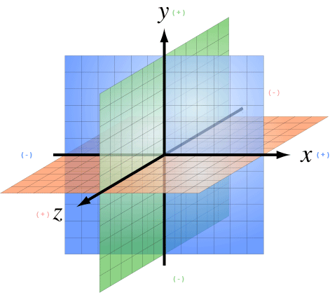

# Introduction to Types and Math

!!! info "From jME3 wiki"
    This is an excerpt from the jME3 wiki, check the original article for more details: [Math overview](https://wiki.jmonkeyengine.org/docs/3.4/tutorials/concepts/math.html)
    

<iframe src="https://wiki.jmonkeyengine.org/tutorials/math/assets/fallback/index.html" width="100%" height="900px" frameborder="0" scrolling="no" sandbox="allow-scripts allow-same-origin allow-popups allow-forms"></iframe>

## Coordinate System

A _coordinate system_ consists of an origin (single point in space) and three coordinate axes that are each unit length and mutually perpendicular. The axes can be written as the column of a Matrix, R = [U1|U2|U3].

NGE uses a Right-Handed coordinate system (as OpenGL does).




## Transformations

!!! abstract "See [Transform Javadoc](https://javadoc.ngengine.org/com/jme3/math/Transform.html)"

Transformations define an operation that converts points from one coordinate system to another. This includes translation, rotation and scaling. In NGE, local transforms are used to represent the positioning of objects relative to a parent coordinate system. While, world transforms are used to represent the positioning of objects in a global coordinate system.


## ColorRGBA

!!! abstract "See [ColorRGBA Javadoc](https://javadoc.ngengine.org/com/jme3/math/ColorRGBA.html)"

ColorRGBA defines a color value in NGE. The color value is made of three components, red, green and blue. A fourth component defines the alpha value (transparent) of the color. Every value is set between [0, 1].

!!! tip
    If you would like to <q>convert</q> an ordinary RGB value (0-255) to the format used here (0-1), simply multiply it with: 1/255.


## Matrix
!!! abstract "See [Matrix3f Javadoc](https://javadoc.ngengine.org/com/jme3/math/Matrix3f.html) and [Matrix4f Javadoc](https://javadoc.ngengine.org/com/jme3/math/Matrix4f.html)"

A Matrix is typically used as a _linear transformation_ to map vectors to vectors. 
That is: Y = MX where X is a Vector and M is a Matrix applying any or all transformations (scale, [rotate](./3D-rotation.md), translate).
NGE includes two types of Matrix classes: **Matrix3f** and **Matrix4f**. 
**Matrix3f** is a 3x3 matrix and is the most commonly used (able to handle scaling and rotating), while **Matrix4f** is a 4x4 matrix that can also handle translation.


## Vector

!!! abstract "See [Vector3f Javadoc](https://javadoc.ngengine.org/com/jme3/math/Vector3f.html) and [Vector2f Javadoc](https://javadoc.ngengine.org/com/jme3/math/Vector2f.html)"

Vectors are used to represent a multitude of things in NGE, points in space, vertices in a triangle mesh, normals, etc. These classes (Vector3f in particular) are probably the most used class in NGE.


## Quaternion

!!! abstract "See [Quaternion Javadoc](https://javadoc.ngengine.org/com/jme3/math/Quaternion.html)"

NGE makes use of Quaternions because they allow for compact representations of rotations, or correspondingly, orientations, in 3D space. With only four float values, we can represent an object’s orientation, where a rotation matrix would require nine. They also require fewer arithmetic operations for concatenation.

*Additional benefits of the Quaternion is reducing the chance of [Gimbal Lock](http://en.wikipedia.org/wiki/Gimbal_lock) and allowing for easily interpolation between two rotations (spherical linear interpolation or slerp).*

!!! tip
    While Quaternions are quite difficult to fully understand, there are an exceeding number of convenience methods to allow you to use them without having to understand the math behind it. Basically, these methods involve nothing more than setting the Quaternion’s x,y,z,w values using other means of representing rotations. 


### Angle Axis

You might wish to represent your rotations as Angle Axis pairs. That is, you define a axis of rotation and the angle with which to rotate about this axis. 
Quaternions defines a method `fromAngleAxis` (and `fromAngleNormalAxis`) to create a Quaternion from this pair. You can also obtain a Angle Axis rotation from an existing Quaternion using `toAngleAxis`.

!!! example "Rotate a Spatial Using fromAngleAxis"
    ```java
    //rotate about the Y-Axis by approximately 1 pi
    Vector3f axis = Vector3f.UNIT_Y;
    // UNIT_Y equals (0,1,0) and does not require to create a new object
    float angle = 3.14f;
    s.getLocalRotation().fromAngleAxis(angle, axis);
    ```

### Three Angles

You can also represent a rotation by defining three angles. The angles represent the rotation about the individual axes. Passing in a three-element array of floats defines the angles where the first element is X, second Y and third is Z. The method provided by Quaternion is `fromAngles` and can also fill an array using `toAngles`

!!! example "Rotate a Spatial Using fromAngles"

    ```java
    //rotate 1 radian on the x, 3 on the y and 0 on z
    float[] angles = {1, 3, 0};
    s.getLocalRotation().fromAngles(angles);
    ```

### Three Axes

If you have three axes that define your rotation, where the axes define the left axis, up axis and directional axis respectively) you can make use of `fromAxes` to generate the Quaternion. It should be noted that this will generate a new Matrix object that is then garbage collected, thus, this method should not be used if it will be called many times. Again, `toAxes` will populate a Vector3f array.

!!! example "Rotate a Spatial Using fromAxes"

    ```java
    //rotate a spatial to face up ~45 degrees
    Vector3f[] axes = new Vector3f[3];
    axes[0] = new Vector3f(-1, 0, 0); //left
    axes[1] = new Vector3f(0, 0.5f, 0.5f); //up
    axes[2] = new Vector3f(0, 0.5f, 0.5f); //dir
    s.getLocalRotation().fromAxes(axes);
    ```

### Rotation Matrix

Commonly you might find yourself with a Matrix defining a rotation. In fact, it’s very common to contain a rotation in a Matrix, create a Quaternion, rotate the Quaternion, and then get the Matrix back. Quaternion contains a `fromRotationMatrix` method that will create the appropriate Quaternion based on the given Matrix. The `toRotationMatrix` will populate a given Matrix.

!!! example "Rotate a Spatial Using a Rotation Matrix"

    ```java
    Matrix3f mat = new Matrix3f();
    mat.setColumn(0, new Vector3f(1,0,0));
    mat.setColumn(1, new Vector3f(0,-1,0));
    mat.setColumn(2, new Vector3f(0,0,1));
    s.getLocalRotation().fromRotationMatrix(mat);
    ```

As you can see there are many ways to build a Quaternion. This allows you to work with rotations in a way that is conceptually easier to picture, but still build Quaternions for internal representation.

### Slerp

One of the biggest advantages to using Quaternions is allowing interpolation between two rotations. That is, if you have an initial Quaternion representing the original orientation of an object, and you have a final Quaternion representing the orientation you want the object to face, you can do this very smoothly with slerp. Simply supply the time, where time is [0, 1] and 0 is the initial rotation and 1 is the final rotation.

!!! example "Use Slerp to Rotate Between two Quaternions"
    ```java
    /*
    You can interpolate rotations between two quaternions using spherical linear
    interpolation (slerp).
    */
    Quaternion Xroll45 = new Quaternion();
    Xroll45.fromAngleAxis(45 * FastMath.DEG_TO_RAD, Vector3f.UNIT_X);
    //
    Quaternion Yroll45 = new Quaternion();
    Yroll45.fromAngleAxis(45 * FastMath.DEG_TO_RAD, Vector3f.UNIT_Y);

    //the rotation half - way between these two

    Quaternion halfBetweenXroll45Yroll45 = new Quaternion();
    halfBetweenXroll45Yroll45.slerp(Xroll45, Yroll45, 0.5f);
    geom2.setLocalRotation(halfBetweenXroll45Yroll45);

    ```

### Multiplication

You can concatenate (add) rotations: This means you turn the object first around one axis, then around the other, in one step.
```java
Quaternion myRotation = pitch90.mult(roll45); /* pitch and roll */
```

To rotate a Vector3f around its origin by the Quaternion amount, use the multLocal method of the Quaternion:

!!! example
    ```java
    Quaternion myRotation = pitch90;
    Vector3f myVector = new Vector3f(0,0,-1);
    myRotation.multLocal(myVector);

    ```

    
## Line

!!! abstract "See [Line Javadoc](https://javadoc.ngengine.org/com/jme3/math/Line.html)"

A line is a straight one-dimensional figure having no thickness and extending infinitely in both directions. A line is defined by two points **A** and **B** with the line passing through both.

NGE defines a Line class that is defined by an origin and direction. In reality, this Line class is typically used as a _line segment_. Where the line is finite and contained between these two points.

`random` provides a means of generate a random point that falls on the line between the origin and direction points.

!!! example "Find a Random Point on a Line"

    ```java

    Line l = new Line(new Vector3f(0,1,0), new Vector3f(3,2,1));
    Vector3f randomPoint = l.random();

    ```

## Plane

!!! abstract "See [Plane Javadoc](https://javadoc.ngengine.org/com/jme3/math/Plane.html)"

A plane is defined by the equation **N** . (**X** - **X~0~**) = 0 where **N** = (a, b, c) and passes through the point **X~0~** = (x~0~, y~0~, z~0~). **X** defines another point on this plane (x, y, z).

**N** . (**X** - **X~0~**) = 0 can be described as (**N** . **X**) + (**N** . -**X~0~**) = 0

or

(ax + by + cz) + (-ax~0~-by~0~-cz~0~) = 0

where (-ax~0~-by~0~-cz~0~) = d

Where d is the negative value of a point in the plane times the unit vector describing the orientation of the plane.

This gives us the general equation: (ax + by + cz + d = 0)


!!! example "Determining if a Point is On the Positive Side of a Plane"

    ```java

    Vector3f normal = new Vector3f(0,1,0);
    float constant = new Vector3f(1,1,1).dot(normal);
    Plane testPlane = new Plane(normal, constant);

    int side = testPlane.whichSide(new Vector3f(2,1,0));

    if(side == Plane.NO_SIDE) {
      System.out.println("This point lies on the plane");
    }

    ```


## Ray

!!! abstract "See [Ray Javadoc](https://javadoc.ngengine.org/com/jme3/math/Ray.html)"

Ray defines a line that starts at a point **A** and continues in a direction through **B** into infinity.
A Ray is cast from a point in screen space into the scene. Intersections are found and returned. To create a ray supply the object with two points, where the first point is the origin.

!!! example "Create a Ray That Represents Where the Camera is Looking"

    ```java

    Ray ray = new Ray(cam.getLocation(), cam.getDirection());

    ```

## Rectangle

!!! abstract "See [Rectangle Javadoc](https://javadoc.ngengine.org/com/jme3/math/Rectangle.html)"

Rectangle defines a finite plane within three dimensional space that is specified via three points (A, B, C). These three points define a triangle with the forth point defining the rectangle ( (B + C) - A ).


!!! abstract "Define a Rectangle and Get a Point From It"

    ```java

    Vector3f v1 = new Vector3f(1,0,0);
    Vector3f v2 = new Vector3f(1,1,0);
    Vector3f v3 = new Vector3f(0,1,0);
    Rectangle r = new Rectangle(v1, v2, v3);
    Vector3f point = r.random();

    ```

## Triangle

!!! abstract "See [Triangle Javadoc](https://javadoc.ngengine.org/com/jme3/math/Triangle.html)"

A triangle is a 3-sided polygon. Every triangle has three sides and three angles, some of which may be the same. If the triangle is a right triangle (one angle being 90 degrees), the side opposite the 90 degree angle is the hypotenuse, while the other two sides are the legs. All triangles are [convex](http://en.wikipedia.org/wiki/Convex_polygon) and [bicentric](http://mathworld.wolfram.com/BicentricPolygon.html).

!!! example "Creating a Triangle"

    ```java

    //the three points that make up the triangle
    Vector3f p1 = new Vector3f(0,1,0);
    Vector3f p2 = new Vector3f(1,1,0);
    Vector3f p3 = new Vector3f(0,1,1);
    Triangle t = new Triangle(p1, p2, p3);

    ```

## Tips and Tricks

### How do I get height/width of a spatial?


```java
Vector3f extent = ((BoundingBox) spatial.getWorldBound()).getExtent(new Vector3f());
float x = ( (BoundingBox)spatial.getWorldBound()).getXExtent();
float y = ( (BoundingBox)spatial.getWorldBound()).getYExtent();
float z = ( (BoundingBox)spatial.getWorldBound()).getZExtent();

```

### How do I position the center of a Geometry?

```java
geo.center().move(pos);
```
