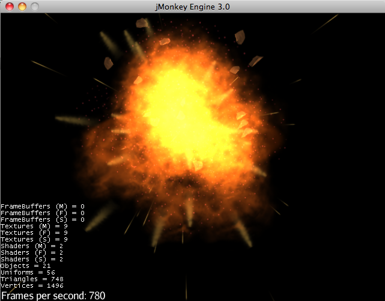
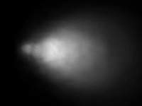
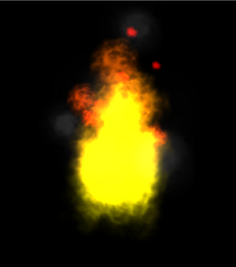
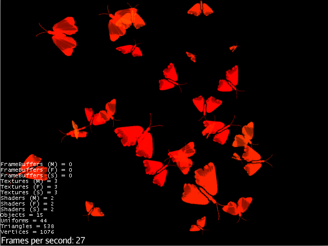
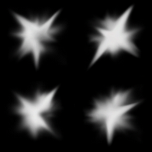

!!! info "From jME3 wiki"
    This is an excerpt from the jME3 wiki, check the original articles for more details: [Particle Emitter](https://wiki.jmonkeyengine.org/docs/3.4/core/effect/particle_emitters.html)


Particle Emitters render a series of flat orthogonal images and manipulates them in a way that creates the illusion of a anything from a delicate smoke cloud to individual flames, etc.
Creating an effect involves some trial and error to get the settings _just right_, and it’s worth exploring the expressiveness of the options described below.






## Create an Emitter

!!! abstract "See [ParticleEmitter Javadoc](https://javadoc.ngengine.org/com/jme3/effect/ParticleEmitter.html)"

1. Create one emitter for each effect:

   ```java
   ParticleEmitter explosion = new ParticleEmitter(
   "My explosion effect", Type.Triangle, 30);
   ```
2. Attach the emitter to the rootNode and position it in the scene:

   ```java
   rootNode.attachChild(explosion);
   explosion.setLocalTranslation(bomb.getLocalTranslation());
   ```
3. Trigger the effect by calling

   ```java
   explosion.emitAllParticles()
   ```
4. End the effect by calling

   ```java
   explosion.killAllParticles()
   ```
 

## Configure Parameters

Not all of these parameters are required for all kinds of effects. If you don’t specify one of them, a default value will be used.

| Parameter | Method | Default | Description |
| --- | --- | --- | --- |
| number | `setNumParticles()` |  | The maximum number of particles visible at the same time. Specified by user in constructor. |
| emission rate | `setParticlesPerSec()` | 20 | Density of the effect, how many new particles are emitted per second.<br> Set to zero to control the start/end of the effect.<br> Set to a number for a constantly running effect. |
| size | `setStartSize()`, `setEndSize()` | 0.2f, 2f | The radius of the scaled sprite image. Set both to same value for constant size effect.<br> Set to different values for shrink/grow effect. |
| color | `setStartColor()`, `setEndColor()` | gray | Controls how the opaque (non-black) parts of the texture are colorized.<br> Set both to the same color for single-colored effects (e.g. fog, debris).<br> Set both to different colors for a gradient effect (e.g. fire). |
| direction/velocity | `getParticleInfluencer(). setInitialVelocity(initialVelocity)` | Vector3f(0,0,0) | A vector specifying the initial direction and speed of particles. The longer the vector, the faster. |
| fanning out | `getParticleInfluencer().setVelocityVariation(variation)` | 0.2f | How much the direction (`setInitialVelocity()`) can vary among particles. Use a value between 1 and 0 to create a directed swarm-like cloud of particles.<br> 1 = Maximum variation, particles emit in random 360° directions (e.g. explosion, butterflies).<br> 0.5f = particles are emitted within 180° of the initial direction.<br> 0 = No variation, particles fly in a straight line in direction of start velocity (e.g. lasergun blasts). |
| direction<br> (pick one) | `setFacingVelocity()` | false | true = Flying particles pitch in the direction they’re flying (e.g. missiles).<br> false = Particles keep flying rotated the way they started (e.g. debris). |
| direction<br> (pick one) | `setFaceNormal()` | Vector3f.NAN | Vector3f = Flying particles face in the given direction (e.g. horizontal shockwave faces up = Vector3f.UNIT_Y).<br> Vector3f.NAN = Flying particles face the camera. |
| lifetime | `setLowLife()`, `setHighLife()` | 3f, 7f | The time period before a particle fades is set to a random value between minimum and maximum; minimum must be smaller than maximum. A minimum &lt; 1f makes the effect more busy, a higher minimum looks more steady. Use a maximum &lt; 1f for short bursts, and higher maxima for long lasting swarms or smoke. Set maximum and minimum to similar values to create an evenly spaced effect (e.g. fountain), set the to very different values to create a distorted effect (e.g. fire with individual long flames). |
| spinning | `setRotateSpeed()` | 0f | 0 = Flying particles don’t spin while flying (e.g. smoke, insects, controlled projectiles).<br> > 0 = How fast particle spins while flying (e.g. debris, shuriken, missiles out of control). |
| rotation | `setRandomAngle()` | false | true = The particle sprite is rotated at a random angle when it is emitted (e.g. explosion, debris).<br> false = Particles fly straight like you drew them in the sprite texture (e.g. insects). |
| gravity | `setGravity()` | Vector3f(0.0f,0.1f,0.0f) | Particles fall in the direction of the vector (e.g. debris, sparks).<br> (0,0,0) = Particles keep flying in start direction (e.g. flames, zero-gravity explosion.) |
| start area | `setShape(new EmitterSphereShape( Vector3f.ZERO, 2f));` | EmitterPointShape() | By default, particles are emitted from the emitters location (a point). You can increase the emitter shape to occupy a sphere, so that the start point of new particles can be anywhere inside the sphere, which makes the effect a bit more irregular. |

Build up your effect by specifying one parameter after the other. If you change several parameters at the same time, it’s difficult to tell which of the values caused which outcome.

## Create an Effect Material



Use the common `Particle.j3md` Material Definition and a texture to specify the shape of the particles. The shape is defined by the texture you provide and can be anything – debris, flames, smoke, mosquitoes, leaves, butterflies… be creative.

```java

Material flash_mat = new Material(assetManager, "Common/MatDefs/Misc/Particle.j3md");
flash_mat.setTexture("Texture", assetManager.loadTexture("Effects/Explosion/flash.png"));
flash.setMaterial(flash_mat);
flash.setImagesX(2); // columns
flash.setImagesY(2); // rows
flash.setSelectRandomImage(true);

```

The effect texture can be one image, or contain a sprite animation – a series of slightly different pictures in equally spaced rows and columns. If you choose the sprite animation:

* Specify the number of rows and columns using setImagesX(2) and setImagesY().
* Specify whether you want to play the sprite series in order (animation), or at random (explosion, flame), by setting setSelectRandomImage() true or false.

!!! tip
    Use the `setStartColor()`/`setEndColor()` settings described above to colorize the white and gray parts of textures.


!!! example "Example: Fire effect"

    ```java

    ParticleEmitter fire = new ParticleEmitter("Emitter", Type.Triangle, 30);
    Material mat_red = new Material(assetManager, "Common/MatDefs/Misc/Particle.j3md");
    mat_red.setTexture("Texture", assetManager.loadTexture("Effects/Explosion/flame.png"));
    fire.setMaterial(mat_red);
    fire.setImagesX(2); fire.setImagesY(2); // 2x2 texture animation
    fire.setEndColor(  new ColorRGBA(1f, 0f, 0f, 1f));   // red
    fire.setStartColor(new ColorRGBA(1f, 1f, 0f, 0.5f)); // yellow
    fire.getParticleInfluencer().setInitialVelocity(new Vector3f(0,2,0));
    fire.setStartSize(1.5f);
    fire.setEndSize(0.1f);
    fire.setGravity(0,0,0);
    fire.setLowLife(0.5f);
    fire.setHighLife(3f);
    fire.getParticleInfluencer().setVelocityVariation(0.3f);
    rootNode.attachChild(fire);

    ```

Browse the full source code of all [effect examples](https://github.com/NostrGameEngine/ngengine/tree/master/jme3-examples/src/main/java/jme3test/effect) here.

 