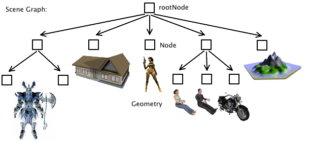

# The Scene Graph

!!! info "From jME3 wiki"
    This is an excerpt from the jME3 wiki, check the original articles for more details: [The Scene Graph](https://wiki.jmonkeyengine.org/docs/3.4/tutorials/concepts/the_scene_graph.html)
    
<iframe src="https://wiki.jmonkeyengine.org/tutorials/scenegraph/assets/fallback/index.html" width="100%" height="900px" frameborder="0" scrolling="no" sandbox="allow-scripts allow-same-origin allow-popups allow-forms"></iframe>

A **scene graph** is a hierarchical tree structure that represents all objects in the 3D world.
It is composed of **spatials**, which are entities that can be rendered or manipulated in 3D space.

Spatials can be:

* **Nodes** — Logical containers that can hold other spatials, including other nodes or geometries.
* **Geometries** — Actual 3D objects that have a mesh and a material.

The top-most node in the scene graph is referred to as the **root node**.


The scene graph is typically updated from a [Component or Control](./getting-started.md/#adding-and-managing-components)

## Node versus Geometry

In your Java code, a Spatial is either an instance of `com.jme3.scene.Node` or a `com.jme3.scene.Geometry` instance. You use the two types of Spatials for different purposes:




### Spatials

!!! abstract "See [Spatial Javadoc](https://javadoc.ngengine.org/com/jme3/scene/Spatial.html)"

A Spatial is an abstract data structure that stores user data and transformations (= translation, rotation, scale) of elements of the 3D scene graph. Spatials can be saved and loaded using the [Asset Manager](./assets.md).


All spatials have the following properties:

- **Name**: A name for identification, used for debugging or finding spatials in the scene graph.
- **Transformations**: Position, rotation, and scale in 3D space.
- **Bounding volumes**: Used for view frustum culling and collision detection.
- **Controls**: Behaviors or scripts attached to the spatial.

!!! example
    ```java
    spatial.setLocalTranslation(new Vector3f(0, 0, 0));
    spatial.setLocalRotation(new Quaternion().fromAngles(0, FastMath.PI / 4, 0));
    spatial.setLocalScale(new Vector3f(1, 1, 1));
    spatial.addControl(new MyCustomControl());
    ```


### Geometries
!!! abstract "See [Geometry Javadoc](https://javadoc.ngengine.org/com/jme3/scene/Geometry.html)"

Use Geometries to represent an object’s look: Every Geometry contains a polygon mesh and a material, specifying its shape, color, texture, and opacity/transparency.

You attach Geometries to Nodes.

- **Visibility**: A Geometry represents a visible 3D object in the scene graph.
- **Content**: Transformations; custom user data; mesh and material;
- **Examples**: Box, sphere, player, building, terrain, vehicle, missiles, NPCs, etc…

!!! example
    ```java
    Geometry geometry = new Geometry("MyGeometry", new Box(1, 1, 1));
    Material material = new Material(assetManager, "Common/MatDefs/Light/Lighting.j3md");
    material.setColor("Diffuse", ColorRGBA.Blue);
    geometry.setMaterial(material);
    rootNode.attachChild(geometry);
    ```
!!! warning
    Every geometry must have a material assigned, or rendering will fail with an error.

### Nodes
!!! abstract "See [Node Javadoc](https://javadoc.ngengine.org/com/jme3/scene/Node.html)"

Use Nodes to structure and group Geometries and other Nodes. Every Node is attached to one parent node, and each node can have zero or more children (Nodes or Geometries) attached to itself.
When you transform (move, rotate, etc) a parent node, all its children are transformed (moved, rotated, etc).

- **Visibility**: A Node is an invisible “handle” for a group of Spatials in the scene graph.
- **Content**: Transformations; custom user data; child nodes and geometries;
- **Examples**: rootNode, guiNode, audioNode, a custom grouping node such as vehicleNode or shipNode with passengers attached, etc.

!!! example
    ```java
    Node parentNode = new Node("ParentNode");
    Geometry childGeometry = new Geometry("ChildGeometry", new Sphere(32, 32, 1));
    parentNode.attachChild(childGeometry);
    rootNode.attachChild(parentNode);
    ```

---


!!! danger
    You never create a Spatial with ~~Spatial s = new Spatial();~~ ! A Spatial is an abstract concept. You create either a `com.jme3.scene.Node` or `com.jme3.scene.Geometry` instance. Some methods, however, require a `Spatial` type as argument: This is because they are able to accept both Nodes and Geometries as arguments. In this case, you simply _cast_ a Node or Geometry to Spatial.


### AudioNodes

!!! abstract "See [AudioNode Javadoc](https://javadoc.ngengine.org/com/jme3/audio/AudioNode.html)"

 **AudioNodes** are special spatials that play sounds in 3D space.

!!! example
    ```java
    AudioNode sound = new AudioNode(assetManager, "Sounds/explosion.ogg", AudioData.DataType.Buffer);
    sound.setPositional(true);
    sound.playInstance();
    ```

---


### Custom Properties on Spatials

You can set custom properties on any Spatial using the `setUserData` method. This allows you to attach arbitrary data to a spatial, with some limitations:

- The key must be a `String`.
- The value must be a `Savable` object or a primitive or String.

```java
spatial.setUserData("myKey", "myValue");
String value = spatial.getUserData("myKey");
```


This is especially useful to pass additional information from your modelling software to the game engine once you import a model.

Check the [Assets](./assets.md) section for more.